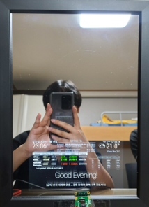
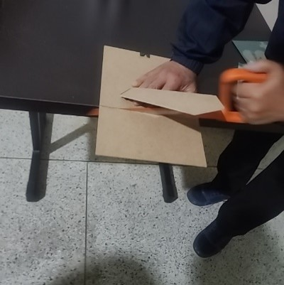
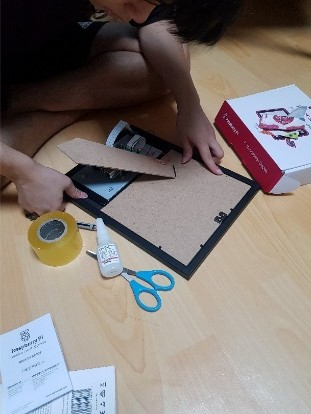
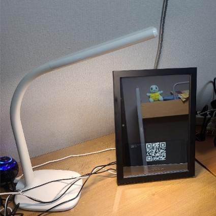
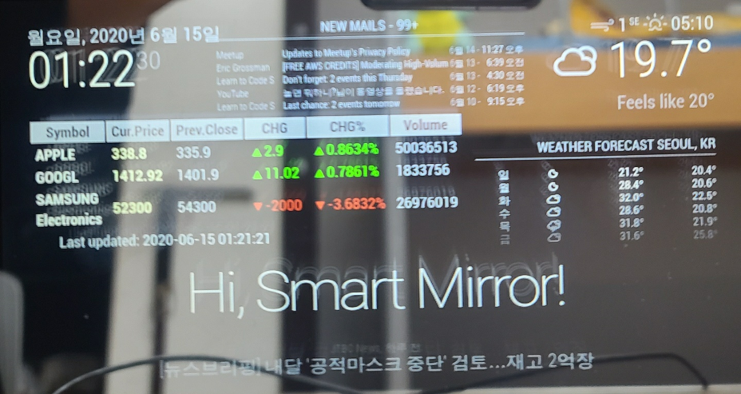

# Informative Smart Mirror

Checkout a demo video of our work [here](https://www.youtube.com/watch?v=BQvdD-lqlTo&feature=youtu.be) (korean)

## 1. Introduction

Smart mirror is a smart device that is normally used like a common mirror, but acts as a PC monitor or smartphone screen through actions such as voice and touch. Recently there have been significant interest in IoT such as smart mirrors, wearable devices. The global smart mirror market was valued at about $1.9 billion in 2018 and is expected to show an average annual growth rate of 11.68% from 2019 to 2026. If we can develop customized smart mirrors so that each user can use them with functions they want, it will maximize the convenience of life. Therefore, we tried to develop a smart mirror which has various functions. For example, informing calendar, weather, stock prices, emails, and news, voice controls, and makeup transfers.

## 2. Environments

- Device : Raspberry Pi 4 b

- OS : Raspberry Pi OS based on debian buster

- Framework : electron (node.js)

- Language : Javascript, Python

- Library : Tensortflow(1.14.0), dlib(19.20.0). picamera

## 3. Development

### 1) Hardware

We processed the frame, and then put the monitor connected to the Raspberry Pi in the frame, and then covered it with a mirror film. We also connected a camera to the Raspberry Pi for CCTV, motion detection, and makeup transfer function.

<!--  -->

### 2) Software

- Developed mirror program based on open-source, [Magic Mirror](https://github.com/MichMich/MagicMirror).
- Added UI modules such as emails and stock prices and voice control module using google assistant API into [config](config.js).
- CCTV and motion detection function using Uv4l and motion API.
- Makeup transfer experience [function](makeup.py) using pre-trained GAN model, [BeautyGAN](https://github.com/Honlan/BeautyGAN).
  - Input data: User's face image without makeup, User's face image with makeup
  - Output data: User's face image with chosen makeup

## 4. Awards

- 3rd prize in Capstone design competition
